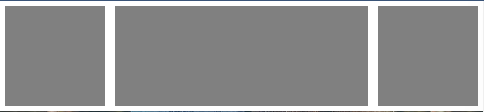
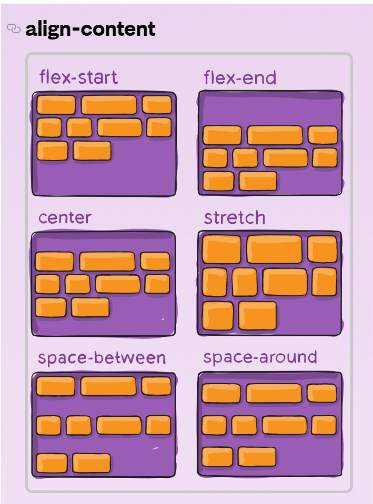

## HTML&CSS REVIEW

### DAY 02
> 1. HTML CSS 웹폰트
> 2. 레이아웃 : FlexBox
> 3. head 태그
---
### HTML CSS 웹폰트
> 폰트파일(ttf)을 따로 다운받아 사용할려면 파일을 다운받고 특정 폴더에 저장해둔다.
- 그리고 CSS 에서 아래와 같이 선언한다.
  ```css
  @font-face {
    font-family : '별칭';
    src : url('폰트경로');
  }
  ```
- 단, 한글 폰트는 크기가 쫌 있어서 2~3개 정도만 사용하는게 좋다.
- 용량을 줄일려면 `ttf` 파일이 아닌 `woff` 파일을 쓰면된다.
  - woff 는 웹 전용 폰트이다.
- 보통 굵은 글꼴을 사용할 때는 `font-weight` 속성을 통해 굵게하는데 이 방법보다 따로 굵은 폰트를 다운받고 사용하는게 더 이쁘다.
- 폰트 용량이 부담스럽다면 [구글폰트](https://fonts.google.com/)를 사용하면 된다.
  - HTML 에 첨부하고 싶으면 `<link>` 태그를, CSS 에 첨부하고 싶으면 `@import` 를 사용하면 된다.
---
### 레이아웃 : FlexBox
> 레이아웃을 꾸밀 때 `float` 이나 `display` 속성을 이용하여 가로 정렬을 할 수 있지만 `display:flex` 를 쓰면 더 쉽게 레이아웃을 꾸밀 수 있다.

- flex를 사용하기 위해서는 요소를 감싸는 `<div>` 박스가 하나 있어야 한다.
- 요소들의 부모요소에 display:flex 를 선언하면 기본값으로 가로정렬 배치가 된다.
  ```html
  <div class="flex-container">
    <div class="box"></div>
    <div class="box"></div>
    <div class="box"></div>
  </div>
  ```
  ```css
  .flex-container {
    display : flex;
  }
  .box {
    width : 100px;
    height : 100px;
    background : grey;
    margin : 5px;
  }
  ```
  
- Flexbox 의 세부속성은 다음과 같다.
  ```css
  .flex-container {
    display: flex; 
    justify-content: center; /* 좌우 정렬 */
    align-items: center; /* 상하 정렬 */
    flex-direction: column; /* 세로 정렬(가로정렬을 row) */
    flex-wrap: wrap; /* 요소의 폭이 넘쳤을 때 다음 줄에 */
  }

  .box{
    flex-grow: 2; /* 폭이 상대적으로 몇배인지 결정 */
  }
  ```
- 박스 좌측&우측 정렬을 동시에 하는법은 다음과 같다.
  ```html
  <div class="flex-container">
    <div class="box"></div>
    <div class="box" style="flex-grow : 1"></div>
    <div class="box"></div>
  </div>
  ```
  
- 좌우정렬을 `justify-content` 속성을 이용했지만 여러 줄의 경우 상하정렬이 필요한 경우가 있다. 이 때 align-items 속성을 사용하는데 아래 그림을 참고하자.
  
    
---
### head 태그
> HTML 에서 사용자가 보는 화면은 `<body>` 태그안에 넣고 그 외 HTML 의 정보들은 `<head>` 태그안에 작성한다.

#### 1. 내부 CSS
- CSS 파일을 첨부할 때 `<link>` 태그에 넣게 된다.
- 경로는 **상대경로**와 **절대경로** 중 하나를 선택하여 경로를 설정한다.
  - **절대경로** : 첨부할 파일의 경로를 적어준다.(`/경로~`)
  - **상대경로** : 현재 파일을 기준으로 상대적인 경로를 적어준다.(`./` : 현재 디렉터리, `../` : 부모 디렉터리)
- `rel` 속성을 이용하여 `stylesheet` 라는 속성값을 줘서 CSS 파일임을 명시한다.
  ```html
  <head>
    <link href="css/main.css" rel="stylesheet">
  </head>
  ```

#### 2. 외부 CSS
- 따로 외부 CSS 파일이 아닌 `<head>` 태그 내부에 지정할 수 있다. 이 때 `<style>` 태그에 스타일 코드를 적어준다.
  ```html
  <head>
    <style>
      .button {
        color : red;
      }
    </style>
  </head>
  ```
  - 참고로 `<body>` 태그에도 적을 수 있지만 *body 태그가 랜더링 되기전에 CSS 에서 특정 요소를 스타일링 한다면 깨질 수 있다 !*

#### 3. 사이트 제목
- 사이트 제목은 브라우저 탭에 들어가는 이름이다. `<title>` 태그를 이용한다.
  ```html
  <head>
    <title>제목입니다.</title>
  </head>
  ```

#### 4. 여러가지 meta 태그
- 인코딩 형식을 지정할 때 `charset` 속성을 사용한다.
- 사이트의 검색 결과 화면에 뜨는 글귀는 `name` 속성과 `content` 속성을 사용한다.
- 사이트 초기 zoom 레벨이나 폭을 지정할 때 `name="viewport"` 속성을 이용한다.
  ```html
  <head>
    <meta charset="UTF-8">
    <meta name="description" content="html 잘하는 코딩애플입니다.">
    <meta name="keywords" content="HTML,CSS,JavaScript,자바스크립트,코딩">
    <meta name="viewport" content="width=device-width, initial-scale=1.0">
  </head>
  ```

#### 5. 파비콘(Favicon)
- 웹사이트 제목 옆 아이콘을 파비콘이라 하는데 커스터마이징 하려면 `<link>` 태그를 이용한다.
  ```html
  <head>
    <link rel="icon" href="아이콘경로.ico" type="image/x-icon">
  </head>
  ```
- `ico` 대신 `png` 파일도 가능하지만 `ico` 파일이 호환성이 좋다.
---
