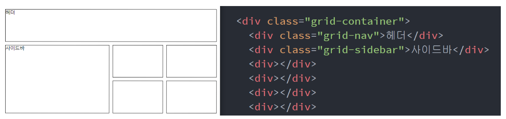

## HTML&CSS REVIEW

### DAY 04
> 1. Sass
> 2. video, audio 
> 3. CSS Grid 레이아웃
> 4. position: sticky 활용

---
## Sass
### 1. Scss 란?
> CSS가 몇천줄이 넘어간다면 관리하는데 큰 부담이 생긴다. `Sass`는 전처리언어인데 **CSS 를 좀 더 프로그래밍 언어스럽게 작성할 수 있는 문법들을 제공**한다.

- 에디터를 VSCode 를 쓴다면 `Live Sass Compiler` 를 다운받으면 된다.
- 우선 `파일명.scss` 파일을 생성하고 실행하면 자동으로 `파일명.css`파일을 만들어준다.
- 그리고 Scss에서는 **CSS 문법을 사용하되 프로그래밍 언어처럼 변수를 선언**할 수 있다.
- 그리고 변수를 이용해 사칙연산도 가능하다!
  ```scss
  $메인칼라 : #2a4cb2;
  $기본사이즈 : 16px;


  // $변수명 : 값;
  .box {
    width: 100px;
    font-size: $기본사이즈 - 2px;
  }

  .background {
    background-color: $메인칼라;
    font-size: $기본사이즈 + 2px;
  }
  ```
### 2. Scss 와 Sass의 차이
- Scss 와 Sass는 똑같이 CSS를 프로그래밍 언어처럼 만든다는 장점이 있으나 괄호를 쓰고 안쓰고 차이가 있다.
  ```sass
  .background
    color : red
  ```
### 3. Nesting 문법
- 보통 특정 클래스 내부에 요소에 스타일을 줄 때 아래와 같이 준다.
  ```css
  .main-bg h4 {
    font-size: 16px;
  }
  ```
- 하지만 `Sass` 의 `Nesting` 문법을 사용하면 좀 더 직관적이다.
  ```scss
  .main-bg {
    h4 {
      font-weight: 500;
    }

    button {
      color: red;
    }
  }
  ```
### 4. 상속문법 - @extend
- 버튼을 예시로 들면 스타일이 똑같은 버튼인데 색깔만 버튼을 구현한다면 다음과 같이 클래스를 나눈다.
  ```css
  .btn{
    width:100px;
    height:100px;
    padding: 20px;
  }

  .btn-red{
    color: red;
  }
  ```
- 하지만 Sass 에서 `@extend` 키워드를 사용하면 좀 더 쉬워진다.
- `%함수명{}` 은 임시 함수이고 사용할 때는 `@extend` 키워드를 사용한다.
  ```scss
  %btn {
    width: 100px;
    height: 100px;
    padding: 20px;
  }

  .btn-green {
    @extend %btn;
    color: green;
  }

  .btn-red {
    @extend %btn;
    color: red;
  }

  .btn-blue {
    @extend %btn;
    color: blue;
  }
  ```
### 5. @Mixin 문법
- `Mixin` 문법도 `extend` 처럼 함수화 하는 문법이지만 `extend` 는 파라미터를 받지 못한다.
- 즉, **함수와 가장 유사한게 Mixin 문법**이다.
- 예를 들어 폰트별로 자간은 같고 글자크기만 다른 스타일이 있다고하자.
  ```css
  h2 {
    font-size: 30px;
    letter-spacing: -1px;
  }

  h3 {
    font-size: 20px;
    letter-spacing: -1px;
  }

  h4 {
    font-size: 10px;
    letter-spacing: -1px;
  }
  ```
- 코드를 보면 폰트사이즈 값만 다르고 나머지는 동일하다. 이 때 Mixin 문법을 사용한다.
- extend 와 다르게 속성에도 파라미터를 줄 수 있고, 속성값에도 파라미터를 줄 수 있다.
  ```scss
  @mixin 폰트스타일($폰트사이즈, $속성, $속성값) {
    font-size: $폰트사이즈;
    #{$속성}: $속성값;
  }

  h2 {
    @include 폰트스타일(40px, width, 100px);
  }

  h3 {
    @include 폰트스타일(40px, height, 200px);
  }

  h4 {
    @include 폰트스타일(40px, background, red);
  }
  ```
- CSS로 잘 컴파일 된 것을 확인할 수 있다.
  ```css
  h2 {
    font-size: 40px;
    width: 100px;
  }

  h3 {
    font-size: 40px;
    height: 200px;
  }

  h4 {
    font-size: 40px;
    background: red;
  }/*# sourceMappingURL=test.css.map */
  ```
### 6. @use 문법
- CSS를 작성하다보면 기본 세팅 코드들을 가장 위에 선언하는 경우가 있다. 
- 만약 여러 파일에서 동일한 세팅코드를 사용한다면 추후 수정시 모든 파일을 또 수정해줘야 하는 번거로움이 있다.
- 이 때 `@use` 문법을 사용한다.
- 그리고 이런 **세팅 코드들은 컴파일 하는것이 불필요**하기 때문에 파일명에 `_` 를 붙혀준다.
```scss
@use '_reset';

// 코드 내용
```
- 그리고 reset 파일에서 선언한 변수도 import 하는 파일에서 사용가능하다.
- 그 때는 `파일명.변수명`으로 접근해야 한다.
---
## video, audio 
### 1. video 태그
- 비디오를 HTML 에 넣기위해 `<video></video>` 태그안에 `<source>` 를 통해 비디오를 삽입하면 된다.
- 사용할 video 파일을 미리 준비하고 `<source>` 태그에 src 속성을 통해 비디오가 저장된 경로를 적어준다.
- 그리고 `<video>` 태그에 다양한 속성을 넣을 수 있는데 다음과 같다.
  ```html
  <video autoplay muted loop poster="썸네일경로" preload="metadata">
    <source src="비디오파일경로">
  </video>
  ```
  - `muted` : 음소거 상태
  - `autoplay` : 자동재생(muted 속성과 함께 써야 동작)
  - `poster` : 썸네일 이미지
  - `preload` : 영상을 먼저 다운을 받을지 말지를 선택
  - `loop` : 무한 재생
### 2. audio 태그
- 오디오도 비디오와 마찬가지로 다양한 속성을 사용가능하고, 선언방식은 다음과 같다.
  ```html
  <audio src="오디오파일 경로" controls autoplay></audio>
  ```
---
## CSS Grid 레이아웃
> Grid 레이아웃은 말 그대로 격자를 만드는 레이아웃입니다.

### 1. 격자형식 만들기
- 격자를 감싸는 부모 `<div>` 태그로 감싸줘야 한다.
- 그리고 부모 태그에 `display` 속성을 이용하여 `grid` 를 선언해준다.
  ```html
  <div class="grid-container">
      <div></div>
      <div></div>
      <div></div>
      <div></div>
      <div></div>
      <div></div>
      <div></div>
  </div>
  ```
- `grid-template-columns` 으로 열 너비와 갯수를 정하고, `grid-template-rows`를 통해 격자의 행 높이와 갯수를 설정한다.
  - 이 때, 단위는 px도 사용가능하지만 fr로 통해 배율을 설정할 수 있다.
  ```css
  .grid-container {
    display: grid;
    grid-template-columns: 1fr 1fr 1fr 1fr;
    grid-template-rows: 100px 100px 100px;
    grid-gap: 10px;
  }
  ```
### 2. 자식 div 높이와 폭 조정
- 자식 태그에 class 값을 줘서 몇 칸을 차지할지 정하는 방법이다.
  ```html
  <div class="grid-container">
      <div class="grid-nav">헤더</div>
      <div class="grid-sidebar">사이드바</div>
      <div></div>
      <div></div>
      <div></div>
      <div></div>
      <div></div>
      <div></div>
      <div></div>
      <div></div>
  </div>
  ```
- `grid-column` 속성은 세로선의 위치값을 통해 정한다. 가장 좌측이 1
- `grid-row` 속성은 가로선의 위치값을 통해 정한다. 가장 상단이 1
  ```css
  .grid-nav {
    grid-column : 1 / 4;
    grid-row : 2 / 4;
  }
  ```
### 3. 자식에게 별칭을 부여하여 부모에서 배치
- 똑같이 class 값을 이용하여 별칭을 지정해준다.
  ```html
  <div class="grid-container">
      <div class="grid-nav">헤더</div>
      <div class="grid-sidebar">사이드바</div>
      <div></div>
      <div></div>
      <div></div>
      <div></div>
      <div></div>
      <div></div>
      <div></div>
      <div></div>
  </div>
  ```
- 그리고 `CSS`에 `grid-area` 속성을 통해 각 자식태그에 별칭을 지정
  ```css
  .grid-nav {
    grid-area: 헤더;
  }

  .grid-sidebar {
    grid-area: 사이드;
  }
  ```
- 그리고 부모 요소에서 별칭을 통해 배치를 한다.
- 자식중에 '헤더' 라는 별칭을 가진 자식이 있다면 첫 행에 4칸을 차지, '사이드' 라는 자식이 있다면 둘째,셋째 행에 2칸씩 차지하는 명령이다.
  ```css
  .grid-container {
    display: grid;
    grid-template-columns: 1fr 1fr 1fr 1fr;
    grid-template-rows: 100px 100px 100px;
    grid-gap: 10px;
    grid-template-areas: 
      "헤더 헤더 헤더 헤더"
      "사이드 사이드 . ."
      "사이드 사이드 . ."
  }
  ```
  
---
## position: sticky 활용
- 스크롤이 되었을 때 화면에 고정되는 요소를 만들고 싶을 떄 사용하는 CSS 속성이다.
- `position: fixed` 와 유사하지만 fixed 는 항상 고정이고, sticky 는 조건부 고정이다.
  - 스크롤이 되어서 특정 요소가 화면에 나오면 고정시킨다는 특징
- 우선 화면 스크롤을 위해 `<body>` 태그에 style 을 줘서 강제로 스크롤을 만든다.
  ```html
  <body style="background : grey; height : 3000px">

  <div class="grey">
    <div class="image">
      
    </div>

    <div style="clear : both"></div>
    <div class="text">Meet the first Triple Camera System</div>
      
  </div>

  </body>
  ```
- 아래 코드처럼 작성하면 스크롤을 되어서 이미지가 보이는 순간 이미지가 고정이 된다. 이 때 위에서 100px 위치에서 고정
- 그리고 부모 박스를 넘어가면 이미지도 같이 사라진다.
  ```css
  .grey {
    background: lightgrey;
    height: 2000px;
    margin-top: 500px;
  }
  .text {
    float: left;
    width : 300px;
  }
  .image {
    float: right;
    width : 400px;
    position: sticky;
    top: 100px;
  }
  ```